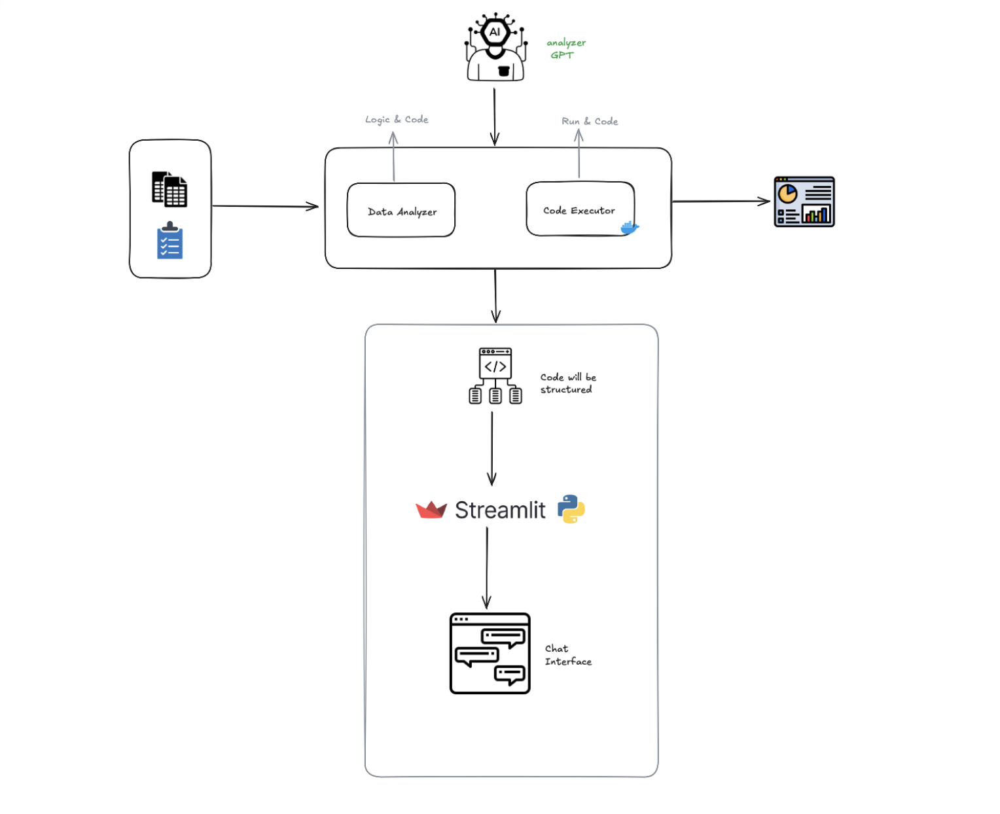

# Analyser-GPT

**Multi-Agent AI Data Analysis Platform powered by Microsoft Autogen, OpenAI, Docker, and uv**

---

## Overview

Analyser-GPT is a agentic AI application designed to automate and streamline data analysis workflows. Leveraging the Microsoft Autogen framework, this project orchestrates multiple specialized AI agents to analyze tabular data, generate Python code, and execute it securely in a Dockerized environment. The results are presented interactively via a modern Streamlit web interface.

---

## Key Technologies

- **Microsoft Autogen**: State-of-the-art framework for building multi-agent, agentic AI systems ([GitHub](https://github.com/microsoft/autogen), [Docs](https://microsoft.github.io/autogen/)).
- **OpenAI GPT-4o**: Advanced LLM for reasoning, code generation, and natural language understanding.
- **Docker**: Isolated Python environment for safe code execution.
- **Streamlit**: Fast, interactive web UI for data upload and chat-based analysis.
- **uv**: Ultra-fast Python package manager and build tool ([uv documentation](https://github.com/astral-sh/uv)).

---

## Architecture & Workflow



1. **User uploads a CSV file** via Streamlit.
2. **Data Analyzer Agent** (LLM-powered):
	 - Receives user queries about the data.
	 - Plans the analysis and generates Python code.
	 - Follows a strict system prompt for reliability and reproducibility.
3. **Code Executor Agent** (Dockerized Python):
	 - Executes the generated code in a secure container.
	 - Handles library installation and error feedback.
	 - Returns results (plots, tables, etc.) to the Data Analyzer.
4. **Round Robin Team Coordination**:
	 - Agents are orchestrated using Autogen’s `RoundRobinGroupChat`.
	 - They collaborate, passing logic and results until the task is complete.
5. **Streamlit UI**:
	 - Displays chat messages, code, and results.
	 - Maintains session state for seamless user experience.

---

## Agentic AI Methodology

- **Multi-Agent Collaboration**: Each agent has a specialized role (analysis, code execution) and communicates via structured messages.
- **Autogen Framework**: Provides robust abstractions for agent creation, team orchestration, and message passing.
- **Safe Execution**: All code runs in Docker, preventing security risks and ensuring reproducibility.
- **Extensible Design**: Easily add new agents, prompts, or data sources.

---

## Project Structure

```
main.py                #  Optional CLI entry point ( used for initial development and testing)
streamlit_app.py       # Web UI entry point
agents/
	Code_executorAgent.py      # Docker-based code executor agent
	Data_analyzer_agent.py     # LLM-powered data analysis agent
	prompts/
		data_analyzer_message.py # System prompt for analysis agent
config/
	constants.py               # Global constants (model, timeout, etc.)
	docker_util.py             # Docker orchestration utilities
models/
	openai_model_client.py     # OpenAI API integration
teams/
	analyzer_gpt.py            # Team orchestration logic
temp/, tmp/                  # Working directories for data/code
test/                        # Unit tests
requirements.txt, pyproject.toml # Dependencies and build config
```

---

## Installation

```bash
# Install uv (if not already installed)
pip install uv

# Install all dependencies
uv pip install -r requirements.txt
# Or use pyproject.toml for modern builds
uv pip install -r pyproject.toml
```

---

## Usage

```bash
# Run the Streamlit web app
uv pip run streamlit_app.py

# Or run CLI demo
uv pip run main.py
```

---
## Learn More

- [Microsoft Autogen Documentation](https://microsoft.github.io/autogen/)
- [Autogen GitHub Repository](https://github.com/microsoft/autogen)
- [Streamlit Documentation](https://docs.streamlit.io/)
- [OpenAI API Reference](https://platform.openai.com/docs/)
- [uv Documentation](https://github.com/astral-sh/uv)


